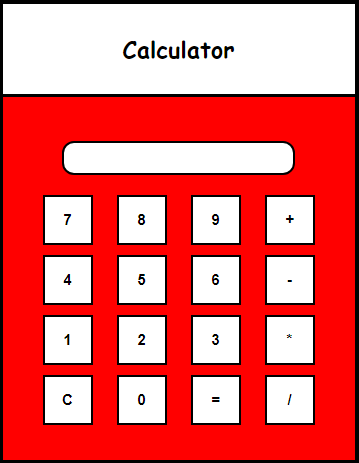

# Calculator-using-HTML
It is a simple Calculator which can perfom basic arithmatic operations like addition, subtraction, multiplication and division.

## About Repository

This repository contains HTML code to build simple calculator. I have use some basic CSS to style my page and JavaScript to perfom operations.

## My Calculator

## Demo site
 
[click here to test](https://omkars-calculator.netlify.app/)

## About Me 
Omkar Atugade, 
Mumbai, Maharashtra, India.

## Follow Me On
 [Instagram](https://www.instagram.com/omi_atugade) 
 [Facebook](https://www.facebook.com/Omkar-Atugade) 
 [Twitter](https://www.twitter.com/Atugade-Omkar)

 
